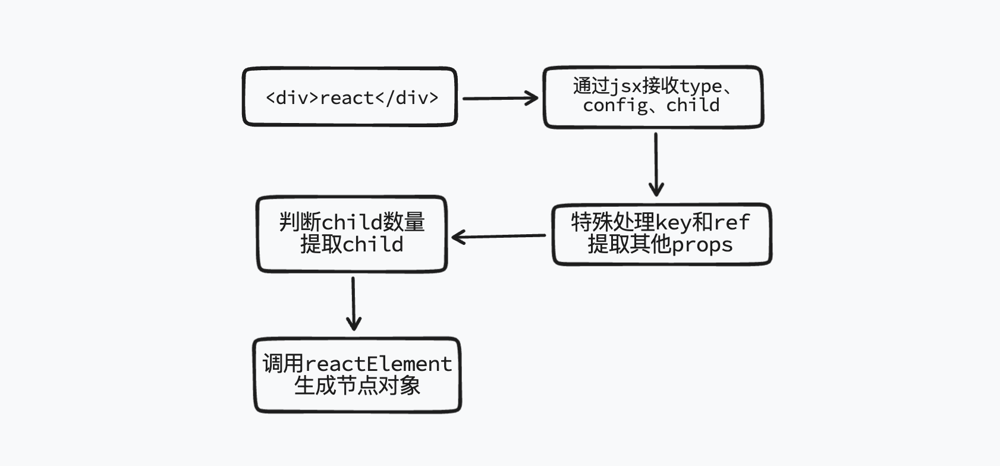

# mini-react

## react 方法实现

### 1. jsx

`packages/react/src/jsx.ts`



## 调试

在`dist/node_modules/react`中执行，使全局都可以调用

```cmd
pnpm link --global
```

创建一个新项目

```cmd
pnpm create vite
```

启动一个新项目后，在新项目中执行命令，使当前的 react 指向全局

```cmd
pnpm link react --global
```

### fiber
